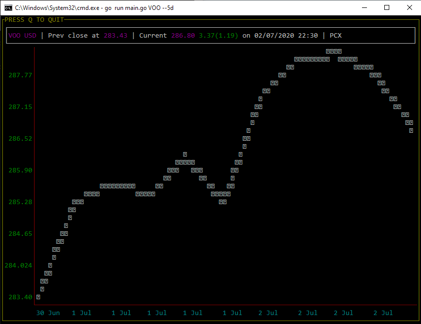

# market-cli

Visualize stocks via terminal.
Data is used from Yahoo Finance

Example:

```
go run main.go VOO --1d
```



# Usage

```
Display stocks in realtime

Usage:
  market [flags]

Flags:
      --1d     Current day
      --1m     Last 1 month
      --1y     Last 1 year
      --2y     Last 2 year
      --3m     Last 3 months
      --5d     Last 5 days
      --5y     Last 5 year
      --6m     Last 6 months
  -h, --help   help for market
      --max    Display whole history
      --ytd    Year to date
```